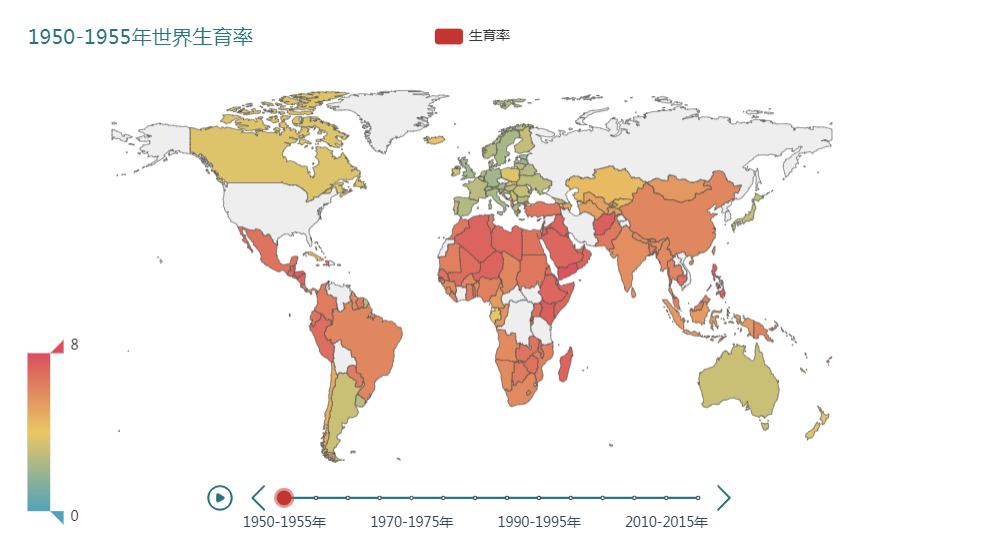
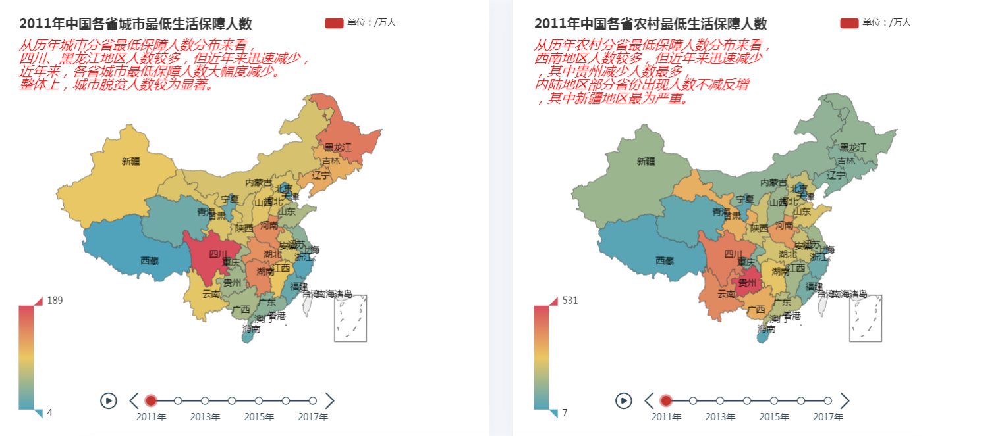
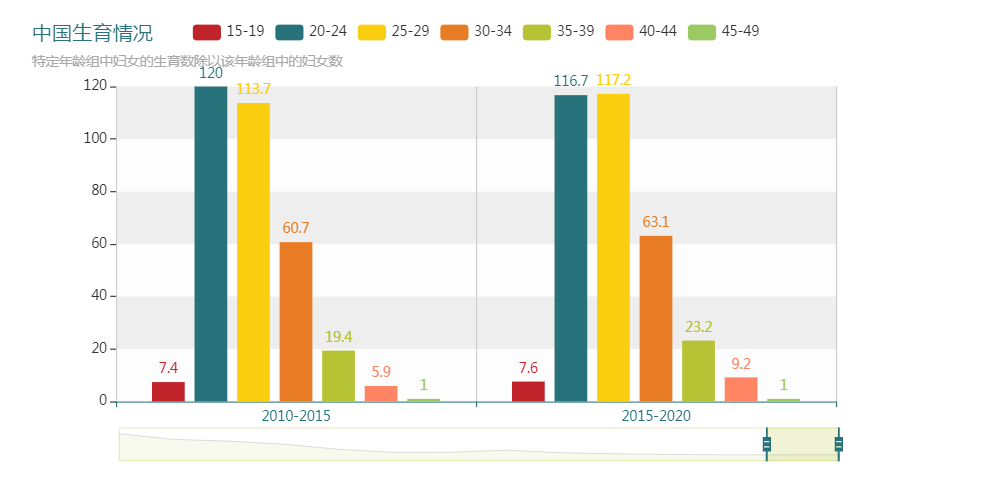

  <h1><a href="http://zxpzxp.cn/">交互式可视化数据故事网站搭建</a></h1>
  
Interactive_Visualization_DataStory_web

> 用于《交互式可视化设计》与《python》实践，自我策展项目

## :pushpin:项目名称：交互可视化:pushpin:
## :accept:项目展示地址[zxpzxp.cn](http://zxpzxp.cn/)
## :paperclip:项目目的：
 - 我的项目分别是精准扶贫后城乡就业的变化趋势和人口老龄化对劳动人口的压力之间的关系。最后分别探讨精准扶贫对人口老龄化对就业带来的不同影响。
 - 通过数据可视化分析精准扶贫后的现状，通过可视化界面展现城乡就业与发展在精准扶贫后的变化，探讨精准扶贫政策对城乡结构、就业发展的影响，并进行总结建议。
 - 通过世界生育率可视化、中国历年生育情况的可视化分析，与老年抚养比、人口结构、各年龄成生育情况，对人口老龄化与劳动人口影响因素进行数据可视化分析，并得出结论与建议
 

## :pencil:背景和意义：
### 背景：
- 人口老龄化会使一个国家的人口年龄结构和劳动年龄结构发生变化,老年人口相对数量和绝对数量的增加会对经济发展造成了一系列影响。而人口老龄化对劳动生产率的影响在不同时期有显著差异,呈现明显的动态特征。短期内,人口老龄化在当期和滞后一期对劳动生产率的影响显著不同。
- 参考文献：[《老龄化与就业不振：警惕“未富先老”的低生育率陷阱》](https://kns.cnki.net/KCMS/detail/detail.aspx?dbcode=CJFQ&dbname=CJFDTEMP&filename=RKJK201907015&v=MDg4ODBOeWJCWmJHNEg5ak1xSTlFWVlSOGVYMUx1eFlTN0RoMVQzcVRyV00xRnJDVVI3cWZadVpwRnlubVdydk0=)
- 参考文献：[《人口老龄化对劳动生产率的影响》](https://kns.cnki.net/KCMS/detail/detail.aspx?dbcode=CJFQ&dbname=CJFDLAST2019&filename=RKYZ201906002&v=MTA1OTExVDNxVHJXTTFGckNVUjdxZlp1WnBGeW5tVmI3Sk55YlNkTEc0SDlqTXFZOUZab1I4ZVgxTHV4WVM3RGg=)
### 意义：
- 随着社会的发展，国家的一些政策问题解决了一些社会痛点，比如精准扶贫带来了大量的就业机会。但也反映了我国劳动人口不足，老龄化进程加快的现实。
- 通过探讨精准扶贫对人口老龄化和就业带来的不同影响，以此能解决我国现在的老龄化问题。以此思考是否可以通过兴新老年产业或者是发展老人大学等来解决该问题。

## :chart_with_upwards_trend:数据来源：
- 数据收集路径主要有 2 种：
	- 国家统计局
	- 世界银行
 
## :octocat:项目内容：
### :one:数据集
- 集合多个现有数据库的数据，且数据完整，有多层次可以供分析的角度
- [数据库仓库]()

### :two:数据故事的选题
选题很有社会价值，并且作品中的阐述方式新颖，很有吸引力
- 当我老了，我还穷怎么办？
>通过马斯洛需求中的安全需求探究在人随年龄健康下降，物质生活有时并未能得到保障的时候，国家做了什么?，我们能做什么?，到底有多少人是有这样的情况?我会不会将来也有这样的情况发生?）
- [数据故事：精准扶贫](http://zxpzxp.cn/fpgy):精准扶贫是基于之前项目进行修改和加深探讨，随着GDP的稳定增加，国家实行了精准扶贫政策，也正是这个政策，城乡低保人数差距缩小，对于就业也带来了深远的印象影响。
- [数据故事：人口老龄化](http://zxpzxp.cn/word):从中国的出生率出发，对比世界的出生率。从世界类比中国；然后再分析我国的人口老龄化现状，探讨人口结构与老龄化的关系，进而老龄化对就业带来的思考。

### :three:数据的地图可视化和交互功能部分
- 交互设计极大增强了表现力，或者本项目不需要地图来表现交互可视化
>通过世界生育率时间线播放图展现历年来的世界生育情况，间接反映出世界人口的增长情况与劳动力资源的变化情况，通过地图交互从时间、生育率与国家三个维度让用户思考我国历年生育率情况与世界的关系。

>通过中国各省农村与城市的最低保障人数时间线播放图中进行对比，从时间、城农结构、生活保障、地区四个维度进行交互探索，从中得出城乡结构与地区、生活保障之间的关系

### :four:数据的非地图可视化和交互功能部分
- 交互设计极大增强了表现力，或者本项目不需要地图来表现交互可视化
> 通过时间拖动轴展现1950~2020年中国各年龄层生育情况，用户可通过拖拉交互，选取自己想了解的年份与年龄层，探索自己所处年龄阶段的生育情况和历年变化。

### :five:交互界面的简单说明
>基于[Argon - Design System](https://demos.creative-tim.com/argon-dashboard/docs/getting-started/overview.html)框架进行开发：
   - [Bootstrap 4](https://getbootstrap.com/)-开源前端框架
   - [jQuery-快速](https://jquery.com/https://jquery.com/)，小型和功能丰富的JavaScript库
   - [Open Sans字体](https://fonts.google.com/specimen/Open+Sans) -Google的开源字体
   - [条纹元素 -表单](https://github.com/stripe/elements-examples/#example-1)，按钮和元素

### :six:数据故事的交互设计
- 通过交互探索，我对这个主题有了非常深刻的认识，也能从交互中发掘出大量之前不知道的信息。
- 比如：该故事说明就业像是一枚硬币。它有时体现出我国政策的有效，但是也从侧面反映了就业率高的背后是年轻人的抚养责任的重大，而这是老龄化的后果。

### 链接：
- [Argon Dashboard UI](https://www.creative-tim.com/product/argon-dashboard) - crafted by Creative-Tim agency
- [Flask Gentelella](https://github.com/afourmy/flask-gentelella) - author **Antoine Fourmy**
- [Flask Boilerplate Dashboard Argon](https://appseed.us/admin-dashboards/flask-boilerplate-dashboard-argon) - Product page
- [Flask Boilerplate Dashboard Argon](https://www.youtube.com/watch?v=bnCuQzDE3Ks/) - Video presentation (Youtube)
- [Flask Framework](https://www.palletsprojects.com/p/flask/) - Offcial website
- [Flask Dashboard - Open-Source Boilerplates](https://dev.to/sm0ke/flask-dashboard-open-source-boilerplates-dkg) - A popular article published on Dev.to platform
- [Flask Dashboard](https://admin-dashboards.com/tags/flask-dashboard) - Index provided by **Admin-Dashboards.com**
- [markdown排版](https://github.com/wenjunmo/DataStory_Interactive-Visualization) 借鉴[Geek Jun](https://github.com/wenjunmo/)
- [markdown EMOJI](https://www.webfx.com/tools/emoji-cheat-sheet/) 
- [flask-bootstrap](https://flask-bootstrap-zh.readthedocs.io/zh/latest/)
- [flask-sqlalchemy](http://www.pythondoc.com/flask-sqlalchemy/quickstart.html)
- [python个人学习记录](https://github.com/huangjieqi/python_note)
- [pythonanywhere背景变色项目](http://huangjieqi.pythonanywhere.com/)
- [个人前端jekyll架站展示](https://huangjieqi.gitee.io/)
- [flask 学习视频](https://www.youtube.com/watch?v=RWviEK1Si68&list=PLDFBYdF-BxV1G4FBpG1EMyFtbsbZuJOvD)
